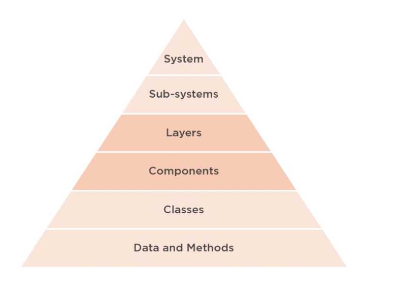

# 1. Introduction

- A tale of two architectures - John and Jane to design building
- John 
  - classical architecture expert
  - Elegant design
  - Hands blueprints of design
- Jane
  - Talks to future inhabitats of building
  - Blueprint about needs
  - Doesn't just hands but continue to interact

## 2. Overview

- Clean Archi
- Domain-centric Archi
- Application layer
- Commands and Queries
- Functional Organization
- Microservices
- Tesable Architecture
- Evolving the Architecture

1. Purpose:
   - Philosohy of architectural essentialism
   - set of patterns, practices and princeipals
2. Alternativ to 3-layer traditional architecture (Database centric)
3. Focus
   1. On enterprise applications
   2. Agile architecture
   3. Top 7 ideas to clean architecture

# 3. What is clean code?

- Software architecture

  - Users
  - User Interface
  -  Business Logic
  - Data Access
  - Database

- Levels of architectural Abstraction

  

- Messy vs clean Architecture:
  - Messy: E.g. Sphagetti
    - Difficult to change one noodle without messing up with other
  - Clean: Lassange
    - Divides noodles horizontally. Clean separation
- Bad architecure
  - Complex (accidental)
  - Incohorent
  - Rigid: resists change
  - Brittle: Small change in one needs changes in other
  - Untestable
- Clean:
  - Simple
  - Understandable
  - Flexible
  - Emergent
  - Testable
  - **Maintainable**
- Clean: Architecture desigend not just for *architect* or *machine* but - **users, developers building the system and maintaining** the system
- Avoid premature optimisation

## 4. Why invest in clean architecture

- Minimize cost
- Maximize value
- Maximize ROI of software
- Only build what is necessary
  - No premature performance optimization
  - optimize for maintainability
  - 60 - 80% of cost of software comes from Maintenance
- **Decisions**:
  - Most architecture related answer -"**It depends**"
  - So, context is king
  - All decisions are a tradeoff
  - Align with business goals

## 5. Demo app

- Home, customers, employees, products, sales

# 6. Summary

- 

