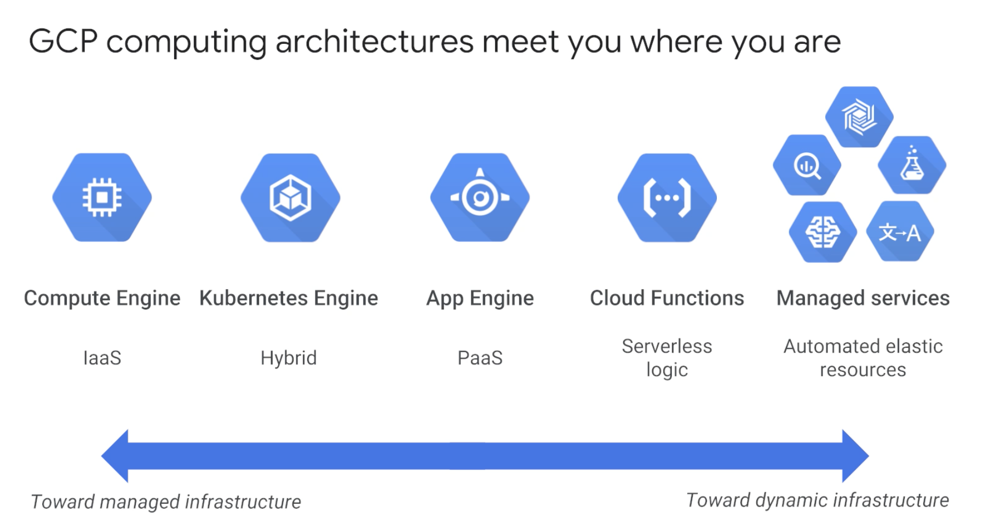
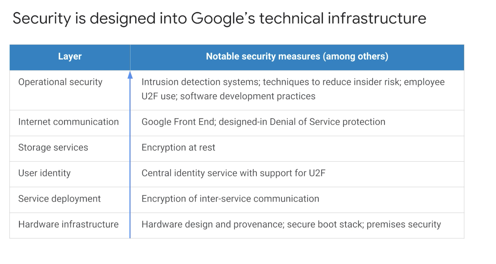

# Introductions

## 1. Welcome

- Four services in GCP
  - Compute
  - Storage
  - Big Data
  - Machine Learning
- Course focuses on first 2 + Networking.

## 2. What is cloud computing?

- Five important traits
  - One demand self-service, no human intervention
  - Broad network access from anywhere
  - Resouce pooling: allocates to customer from pool.
  - Rapid elasticity: Get more or less based on need.
  - Measured service: Pay as you go.

 ## 3. How we got here? (History)
   - First wave colocation.
   - 2nd virtualized in 2000's.
   - 3rd wave - Serverless:  automated containers 

 ## 4. Every company is data company

 ## 5. GCP cloud architecuture
 - 
 - IaaS and PaaS. Ordering from managed to dynamic infrastrure:
   - Compute Engine - IaaS
   - Kubernetes Engine - Hybrid
   - App engine - PaaS
   - Cloud Functions - Serverless logic
   - Managed Servies - automatic elastic resouces
- IaaS -> pay for what you allocate.
- Paas -> Pay for what you use.

## 6. GCP regions and zones

- Zone: Deployment area.
- Zones Grouped into regions.
- All zones within region have fast network within them.
- Fault toleracce: Multiple zones in a region.
- GCP has 15 regions

## 7. Environmental responsibility.
- 100% carbon neutral since 2007

## 8. Customer friendly pricing.
- per second pricing in many

## 9. Multilayer security approach

- 

## 10. GCP Budgets and billing

- 4 tools
  - Budget and alerts: Set limit and alerts
  - Billing Exports: Save to places where easy retrieve. e.g. BigQuery
  - Reports: Visual tool to monitor
  - Quotas: prevent overconsumption
    - Rate quota: reset after specific time
    - Allocation quotas: govern no. of resources you can have in project. 