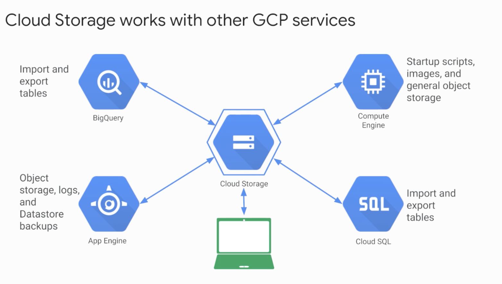
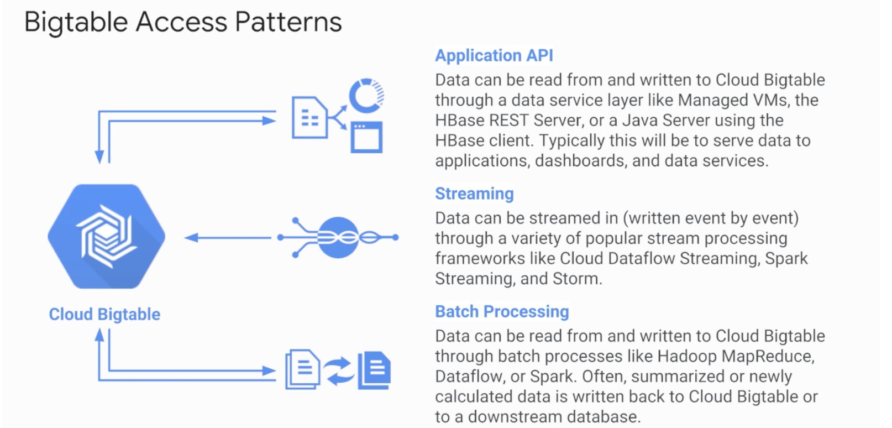

# Storage in the Cloud

## 1 Introduction to GCP storage

4 options

- cloud storage
- cloud SQL
- Cloud spanner
- cloud datastore
- Google Big table

## 2 Google cloud storage

- What is object storage?
- binary large-object storage
- cloud storage works like that.
  - fully managed
  - High durability / availability
- Tasks:
  - website content
  - archieve data
  - distribute via. direct download
- but not a file system.
  - not a root file system of linux
  - but composed of bucket.
  - objects are immutable.
  - Not edit but create new versions
- Encrypt by default.
- **Organized into buckets**
- Turn on object versioning - has history of modifications
- lifecyle management - delete based on condition like older than 360 days.

## 3 Cloud storage interactions

- 4 different classes.
  - multi-regional (more cost)
    - broad geographical location like US, Asia.
    - frequently accessed data
  - regional
    - Data close to compute engine machines
    - data intentisive
  - nearline
    - Low cost.
    - plan to read / modify once or month or less
  - Coldline
    - Very low cost
    - Online backup, data archieve, disaster recovery
    - plan to access at most once a year.
- gsutil / drag or drop

# 4 Cloud BigTable

- fully managed NoSQL db.
- ideal for data that has single lookup query.
- high throughput
- user analytics, financial
- accessed using HBase API.
- Why Bigtable over Hbase?
  - managed, scalable storage
  - Data encryption in-flight
  - control access with IAM
  - powers Google core services - search, Gmail, Maps.
- Access patterns
  - Application Api
  - Streaming
  - Batch Procssing.

# 5 Cloud SQL

- managed RDBMS
- offers MySQL and PostgreSQL (beta when recorded)
- Benefits of managed.
  - several replica services
  - managed backups - horizonal, vertical
  - google security
  - accessible by other GCP and external services
- Cloud spanner - if outgrain any relational db

# 6 Google cloud database

- High scalable NoSQL databse.
- automatic sharding and replicaiton
- Unlike Bigtable - transation to effect multiple rows

# 7 Comparing storage services

# 8 Qwiklabs exercise

- Create a Cloud Storage bucket and place an image into it.
- Create a Cloud SQL instance and configure it.
- Connect to the Cloud SQL instance from a web server.
- Use the image in the Cloud Storage bucket on a web page.