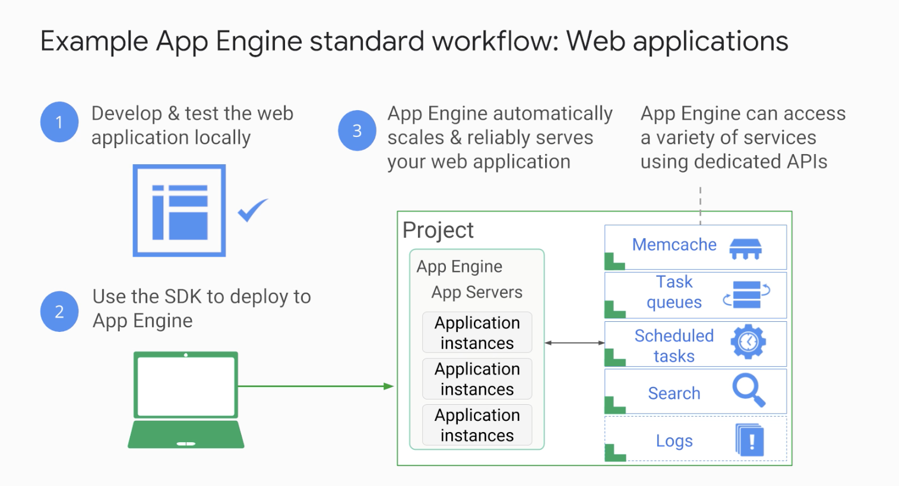
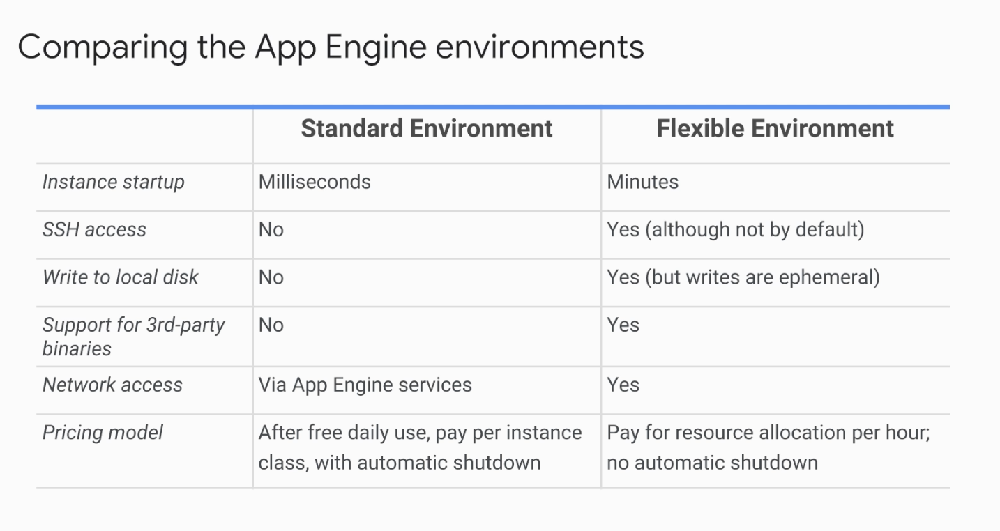
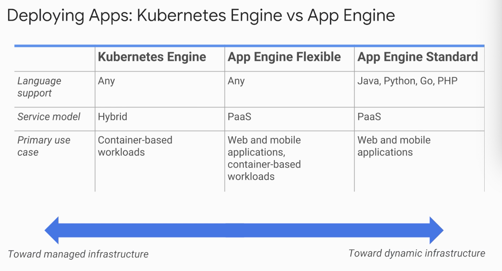

# Application in the cloud

## 1 Introduction

- VM for compute engine
- Container for Kubernetes engine
- PaaS - just focus on application
- App engine: hand your code and it takes cares of the rest
  - automatic resource allocation based on usage
  - two environment - standard and flexible

## 2 GAE standard environment

- Simple deployment compared to flexi

- free daily quota

- SDK in several language

- What does my code run on

  - runtime provided by Google
  - Runtimes for Java, Python, PHP and GO

- Runs in sandbox. Sandbox:

  - can scale and manage in fine way

- Constraints:

  - no writing to local files
  - requirest time out at 60 seconds
  - limits on third-party software

- Choose flexible if constraints not suitable

  

## 3 App Engine Flexible environment

- lets you specify containers to run
- no sanbox constraints
- can access app engine services

## 4 Google cloud endpoints and API

- cloud endpoints: helps manage APIs
- Apigee edge

# 5 Demo: Qwiklabs

- Install the Cloud SDK for App Engine
- Preview an App Engine application running locally in Cloud Shell.
- Deploy an App Engine application, so that others can reach it.
- Disable an App Engine application, when you no longer want it to be visible

