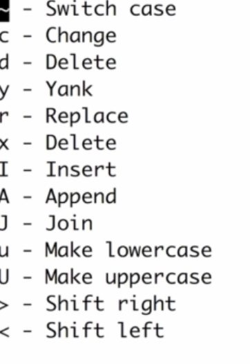

# Basic navigation

- j, k l, h

- ### Word navigation

  - w, W - word, without punctuation
  - b, B - back word

- ### Line navigation

  - 0 - beginning of line
  - ^ - first character of line
  - $ - end of line

- ### Move to line

  - <n> gg or G or :<n> to specific line
  - gg - beginning of file
  - GG - End of file

## Deleting and thinking in Vim

- x simple delete
- X - delete before the cursor. Like backspace
- dw - delete word
  - d - delete
  - w - motion
- dj - line and below
  - dh
  - d0
  - d$
- D - shortcut for d$.
- dd - delete current line

### Count operator motion

- 3w - move 3 words
- 3dw - delete 3 words
  - or d3w
  - 2d3w = 2 * 6 = delete 6 words

## Delete multiple lines

- . -> repeate previous command

# VIm help

- :help or :h
- :help dd
- :help count
- :help linewise

# Cut, Copy and Paste

- delete, yank and put
- d and x -> cut not just delete
- default register -> p (put or paste) after cursor
- P -> paste before cursor.
- Shortcurt for swap -> xp or ddp
- y --> yank (copy)
- Common shortcuts:
  - 2yw or y2w -> copy two words
  - yy -> yanks entire line
  - yyp -> duplicate line
- u -> Undo **last command** 
- ctrl + r -> redo

### Cut, copy paste - registers

- Registers:
  - unnamed register : ""
  - numbered - 0, 1... 9
  - Named: a to z.
- Defaults:
  - "" holds text from d, c, s, x and y
  - 0 holds last yanked
  - 1 hold last d or c (changed)
  - Numbered registerd shift with d or c
  - full control over named registers
- : reg - contents of register
- Using registers
  - "0P - puts from reg. 0
  - "2yy - yanks to register 2.
- "_d -> not stored in register -> black hole register

# Transforming and substituting text

### Insert, change, replace and join

- Insert
  - I - insert before first non-blank in line
  - a - appends text
  - A - append to end of line
  - o - new line below cursor
  - O - new line above cursor.
  - **Shortcut**
    - e.g. 5O#<esc> - Creates 5 new lines beginning with # (not working in ideavim)
- Replace mode
  - R - replaces word under the cursor.
  - r - single character replace
- change
  - cw - change word
  - C - change till the end of line
  - cc - change entire line of text
  - ~ (tilde) change case
  - **Shortcut**
    - g~w - change entire word to upper
    - g~$ - change entire line
    - g~~
  - Uppercase and lowercase:
    - gU <motion>- change to uppercase
    - gL <motion> - lower
  - **Join Lines**
    - J - join lines together.
    - gJ - join lines without spaces between

# Search, Find and Replace

- Find:
  - f<char> or F<char> - back
  - ; and , (repeat search)
  - t<char> - search and move just before char. un**til**
- Search more than 1 char
  - / <chars>
  - n - repeat (next), N - backwards
  - ? <chars> - backward search
- **Incsearch**
  - to enable - :set is
  - It highlights next when manking / search.
- **hlsearch**
  - :set his
  - It highlights all occurance
- Exercise:
  - /and finds and.
  - Cw - change word to say &
  - n - find next
  - . - repeat again
- asterisk(*)  find occurance of same word

### Find and replace

- Substitute
  - s - :s/old/new/ - current line and first occurance
  - :s/old/new/g - all occurance in the line
  - [range]s/old/new/[flags]
    - 1s/old/new/g - replace on line 1
    - 1,5s/old/new/g - on line 1 to 5
    - ranges
      - % - entire file
      - . - current line
      - $ - last line in file
      - .,$ - current to last
      - %s/old/new/g - change in entire file
  - You can use any character for separator
    - e.g.  :%s#old#new#g

# Text objects and Macros

## Text objects

- how do you delete words when the cursor is in middle of word?

- {operator}{a or i}{object} - caw or CaW

  - a means including
  - i - inside it

- Daw - delete all word

- **ciw - change inner word**

- objects

  - w - word - aw
  - s - sentence - as
  - p - paragraph - ap
  - [ or ] - within braces - a[
  - ( or ) - a( or i(

- you can also yank them

  - yiw
  - yi[

- tag object

  - useful in html

  - 
sudip
 - cit changes sudip.

- Quoted string

  - ci"
  - ci'

## Macros

- Also called complex repeats
- Macro recording:
  - q<register> - e.g. qa
  - when done q
  - to play marcro - @<register>
  - or @@ - most recent executed macro
  - 5@<register> - repeat 5 times
- Best practices for macro
  - Normalize the cursor position: 0
  - position to next line after end: j
- Append to macro
  - q<capital_register>
- You can also edit macro
  - How? - paste the vaules of registers - "<reg>p
  - modify
  - yank it to the register - "<reg>y
  - apply macro
- Save macros?
  - Use .vimrc

# Visual Mode

- Alternative to using mouse (more powerful)

1. Three modes
   1. Character wise - v
   2. line wise - V
   3. Block wise - ctrl v
2. Character wise:
   1. v, select with (h or l)
   2. opposite direction o - highlight both direction
   3. Finally yank, delete, change uppercase etc.
   4. yap vs vapy - difference?
3. Linewise:
   1. V  (j or k) or other motion
   2. gv - last selection
4. 
5. Vertical visual mode:
   1. ctrl + v
   2. O - opposite end in line
   3. $ - select till end of every line
   4. A - insert mode end (lowercase doesn't work)
   5. I - insert mode in between
   6. Can achieve similar to sublime (not exact)
6. Substitution to part of file
   1. select visual
   2. and run substitue s/old/new/
7. center command
   1. :center - default 80 width or ce
   2. :center 40
   3. :left or le / : le5
   4. ri 

