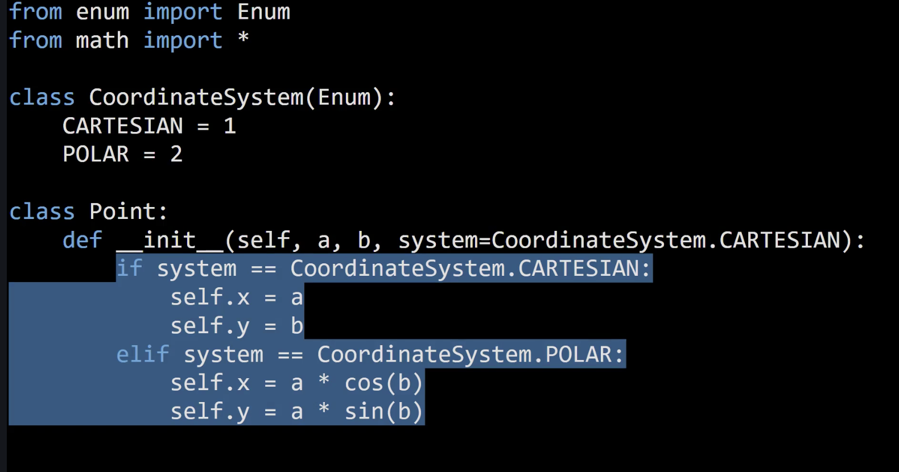
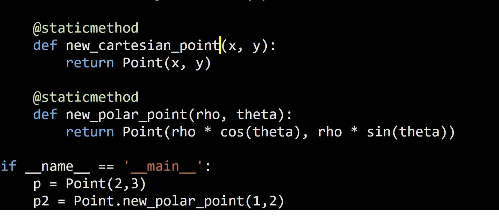

# Factories

- will be using fusion of Factory Method and Abstract Factory

## 1. Why Factories?

- object creation logic becomes too convoluted
- initializer is not descriptive
  - cannot change `__init__`
  - cannot overload with same sets of arguments with different names
  - `optional parameter hell`
- Wholesale object creation
  - unlike Builder
  - A separate method (Factory method)
  - Separate class (Factory)
  - Can create hierarchy of factories with Abstract Factory

> **Factory**: A component responsible solely for the wholesale (not piecewise) creation of objects

## 2. Factory Method

**Problem**:

**Solution**

Use `staticmethod`

### What is factory method?

Modern naming: Any method which creates an object.

- better names than init

## 3. Factory

Create a new class `PointFactory` and include static methods in them.

- You can also include the `Factory` class inside the main class and run `Point.PointFactory.new_polar..`

## 4. AbstractFactory

- if you have hierarchy of types, you can have hierarchies of factories.

## 5 Summary

Factory method: static method that creates objects

Factor: entity that take care of obj. creation

Hierarchies of Factories

