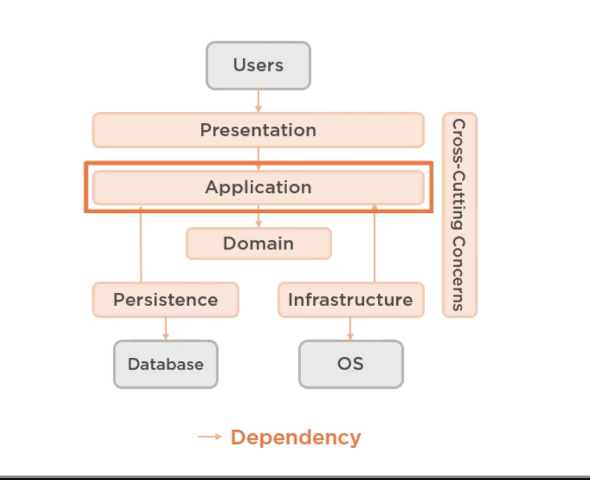
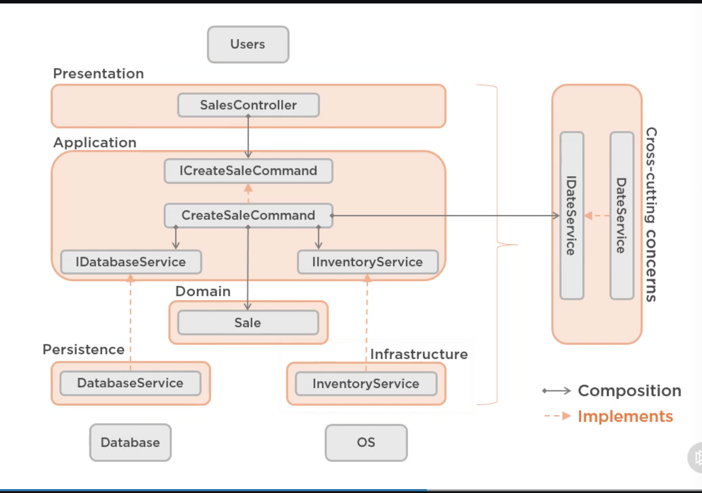

# 1. What are layers

- Abstraction layers

  - Single responsibiility
  - isolate roles and skills
  - multiple implementations

- Classic 3-lyaer

  - User Interface
  - Business Layer
  - Data Access layer

- Modern 4-layer architecture

  

  

- Variations
  - Multiple UI
  - Add web service layer etc.

## 1. Application Layer

- Knows about domain layer.
- No idea oabout presentation, persistnace or infrastructure

- Dependency inversion
  - Abstractions should not depend on details
  - Rather, details should depend on abstractions

## Demo

