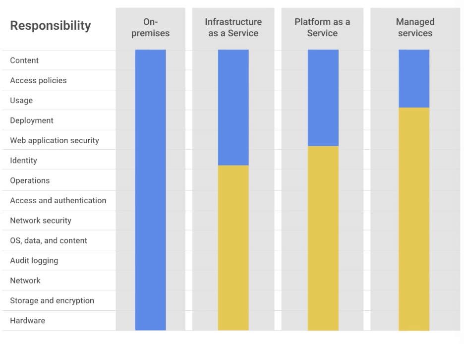
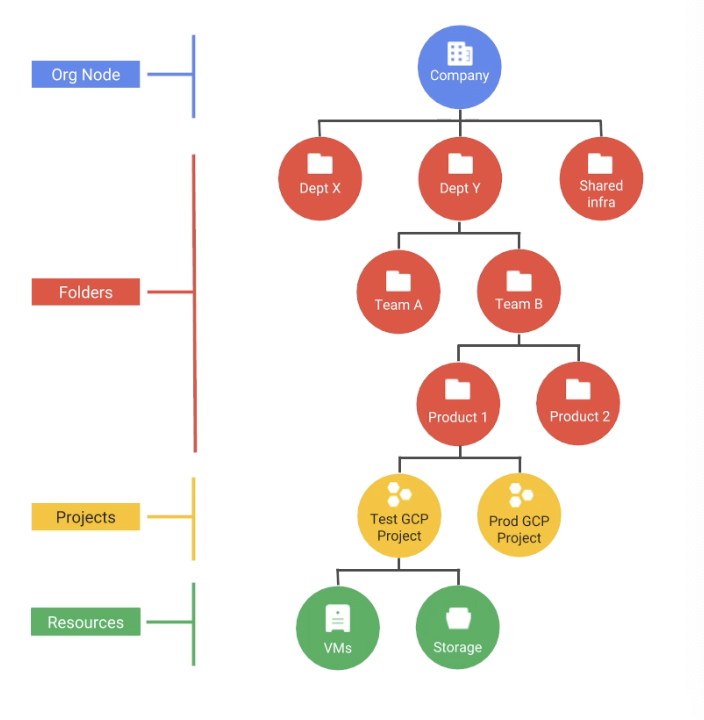
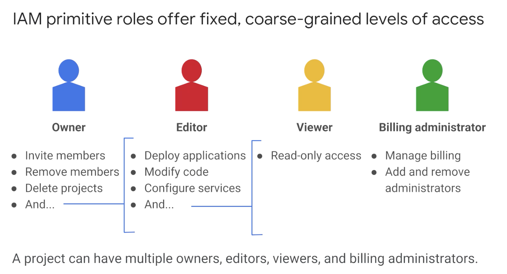

# Getting started with GCP

## 1. Introduction

- principle of least privilege
- user should have only those previlege to do that job
- use IAM for least privilege
- 4 ways to interact
  - Console
  - SDK and command line tools
  - APIs
  - mobile app

## 2 GCP resouce hierarchy

- bottom up understanding
- Org node, folders, projects, resource
- policies are inherited downward in hierarchy

- **Project**: ID (immutable), Name (mutable), Project no. (immutable)
- **Folders**:
  - organize projects to folders. but not required.
  - IAM policies can be set at folder.
  - to have folder, need to have org. node
- **Org Node** 
  - can set org. Policy.
  - control who can spend money
  - G-suite - automatically to org. node.

**Note** The more generous policy takes precedence.

## 3 Identity and Access Management (IAM)

- 3 parts
  - who: can be google account, service account, g-suite etc.
  - can do what:
  - on which resource

### Primitive Roles:

- Owner > editor > viewer.
- also billing administrator

## 4 IAM roles

- Service accounts

## 5 Interacting with GCP

4 ways

### GCP Console

- View and manage all process and resouces
- manage APIs
- access cloud shell
- acess to SDK in cloud shell

### GCP SDK

- gcloud tool: command-line interface
- gsutil: for Google cloud storage
- Bq: BigQuery
- cloud shell or own computer
- SDK available as docker image as well.

### RESTful APIs

- APIs explorer - learn about APIs.
- libraries for API:
  - cloud client libraries: community handled specific to language
  - Google API client libraries: general and complete

## 6 Cloud Marketplace

- Cloud launcher: most images free, some charge fee

## 7 Lab Cloud launcher

- e.g. LAMP stack launch

## 8 Getting started with GCP and Qwiklabs

- practical hands-on experience with GCP.
- Launch bitnami LAMP