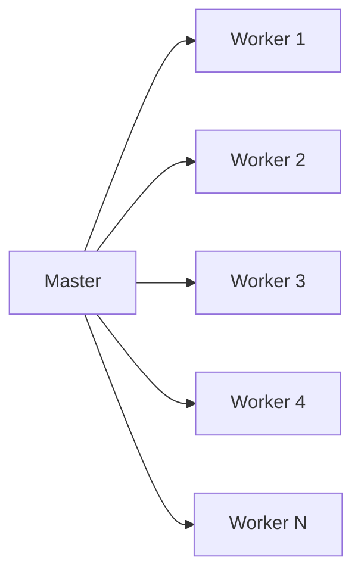
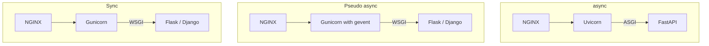

# Navigating the limitations of Python’s concurrency model in web services

- Author: Tarek Mehrez
- Talk page: https://2022.pycon.de/program/EQSRNN/

## Content

- details of the runtimes behind python web frameworks
- ASGIs vs WSGIS.
- FastAPI as an example to discuss ASGI

## Concurrency in python

What are the options?

1. Multiprocessing

2. gevent

3. asyncio

   

## An example of using Flask

- Flask API to serve ML model

- Had a `/predict` endpoint

  

- **Gunicorn**
  - python web server
  - I need 10 processes that listen to requests
  - How many requests can be handled?

- **WSGI**
  - Maps HTTP to python
  - But my code is synchronous???
- **gevent**
  - Before Asyncio,
  - Workers are async

### Asyncio

- Now we have async web frameworks
  - FastAPI, starletter
- WSGI --> ASGI

### The evolution

