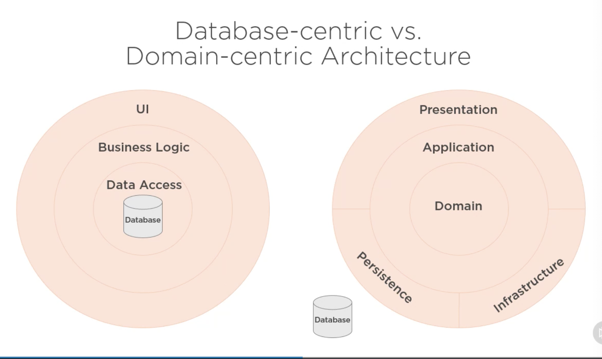
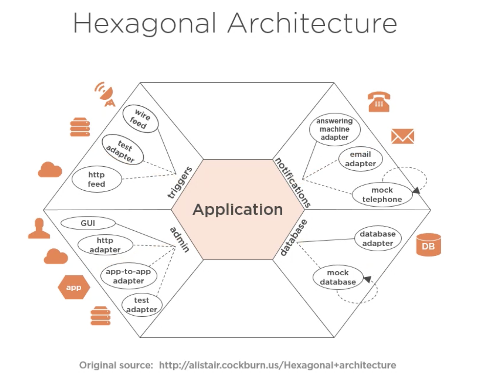
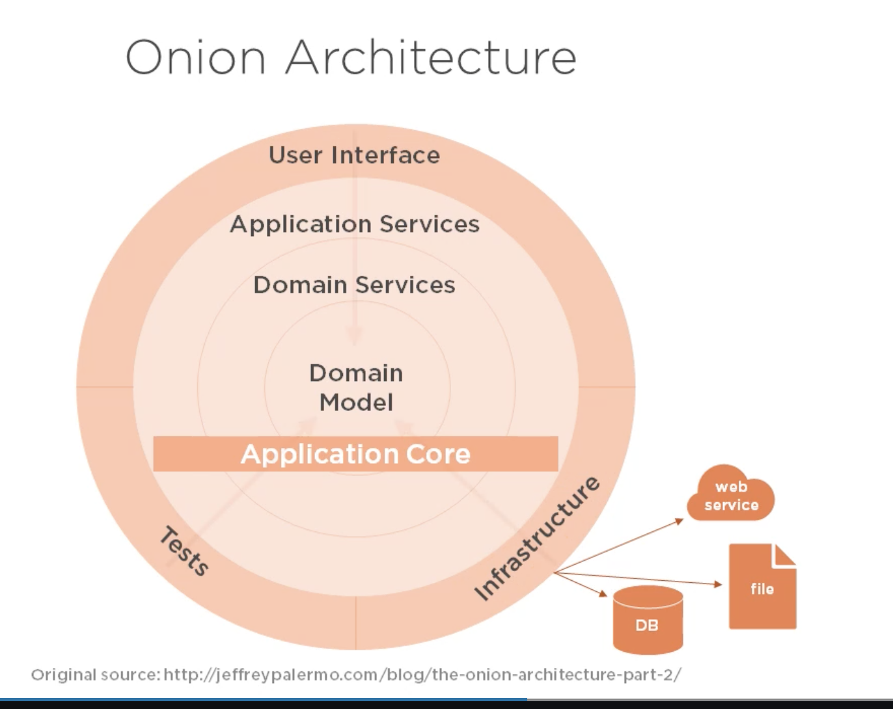
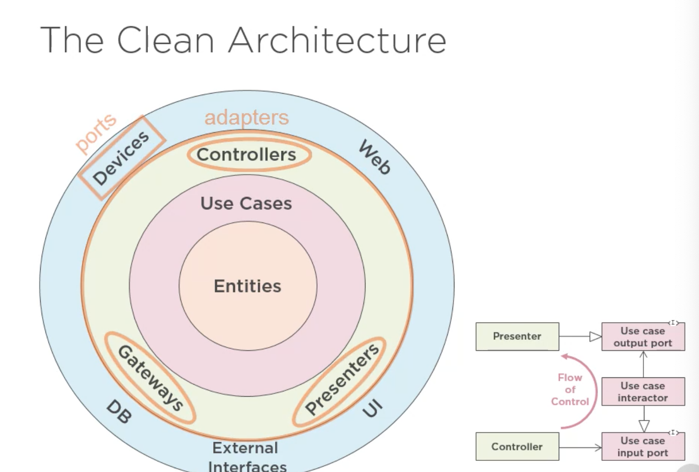

# 1. Intro

- How it differs from DB centric architecture?

# 2. Domain-centric architecture

- E.g. of solar system

  - First people though earch at center
  - Shift in perspective.
  - Makes more elegant due to the shift of thinking

- Similar in Software Architecture

  - Initial - database at center
  - Now - domain
  - Domain is central and database outside

- First concern of architect, to make house usable

- Essential vs Detail, House

  - Space is essential
  - usability is essential
  - Building materal is just detail
  - Oranmentation is detail

- Clean Architecture

  - Domain is essential
  - Use cases are essential
  - presentation is a detail
  - persistence is a detail

- **What is central vs what is detail**

  

## A. Hexagonal Architecture

## B. Onion Archietcure

## C. Clean Architecture

- Also incorporates BCE

- All put domain model in the center

### Pros:

1. Focus on domain
2. Less coupling between domain logic and implementation logic
3. Allows for domain-driven-design

## Cons:

- Change is difficult (people may have no idea about this)
- Requires more though
- Higher initial cost

# 3. Demo

